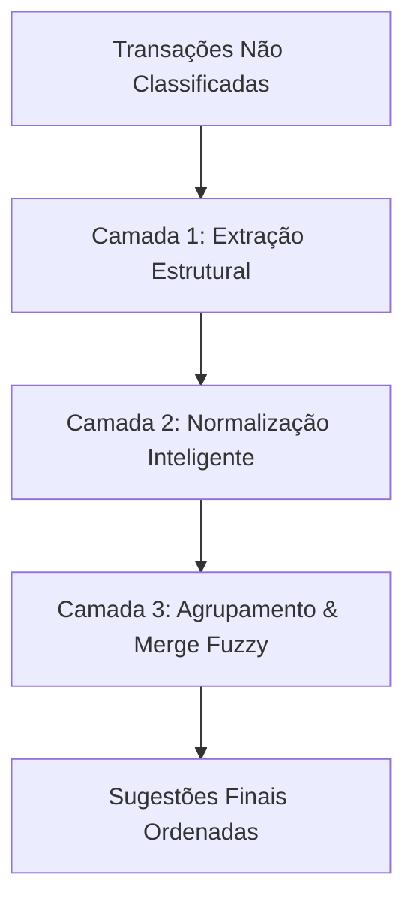

# Algoritmo de Sugestões de Classificação Bancária

## Visão Geral Executiva

O **Algoritmo de Sugestões de Classificação** analisa transações não classificadas no extrato financeiro e identifica automaticamente agrupamentos recorrentes de comerciantes, pessoas e serviços.

Diferente de abordagens genéricas baseadas apenas em contagem de palavras (N-grams) — que falham ao truncar nomes de pessoas e fragmentar marcas como Uber ou 99 — o algoritmo utiliza **Extração Heurística Estruturada em 3 Camadas**, projetada especificamente para o formato das transações bancárias brasileiras (Pix, Cartão de Débito/Crédito, Boletos).

---

## Como Funciona (Pipeline em 3 Camadas)

### 1. Extração Estrutural do Nome
Analisa os campos `titulo` e `descricao` utilizando padrões do sistema bancário brasileiro:
- **Pix Enviado/Recebido:** Extrai o nome completo do favorecido/pagador (ex: *"Pix recebido de ANA CAROLINA FERREIRA..."* → `"ANA CAROLINA FERREIRA MARTINS VIEIRA"`).
- **Débito em Cartão:** Isola o nome do estabelecimento removendo sufixos de localidade/país e datas (ex: *"Uber UBER \*TRIP HELP.U SP BRA"* → `"Uber"`).
- **Identificadores Únicos:** Preserva códigos comerciais relevantes como `99* POP` ou `DL*99 99`.

### 2. Normalização Inteligente
Limpa ruídos e sufixos operacionais sem perder a especificidade do estabelecimento:
- Remove termos corporativos: `LTDA`, `S.A.`, `EIRELI`, `MEIOS DE PAGAMENTO`, etc.
- Remove abreviações de cidades e estados bancários: `RIO DE JANEIR`, `SAO PAULO`, `DUQUE DE CAXI`, `SP`, `RJ`.
- Remove datas e horários embutidos nas descrições de aplicativo (ex: `01Fev 12h44min`).
- Remove prefixos de processadoras como `IFD*` (iFood), mantendo o nome do restaurante.

### 3. Agrupamento e Merge Fuzzy
- **Chave de Comparação:** Converte o nome limpo para formato canônico sem acentos ou caracteres especiais.
- **Merge de Variantes:** Utiliza comparação por prefixo e remoção de preposições (`de`, `da`, `do`) para agrupar variações da mesma entidade (ex: `"THOMAS MELLO OLIVA"` e `"THOMAS DE MELLO OLIVA"` são unificados em um único grupo).
- **Seleção Gulosa (Non-Overlapping):** Cada transação é alocada ao seu grupo mais específico, garantindo que não haja sugestões duplicadas.

---

## Exemplos Práticos de Agrupamento

| Descrição Bruta no Extrato | Entidade Extraída | Sugestão Gerada |
|---|---|---|
| `Uber UBER *TRIP HELP.U SP BRA` | `Uber` | **Uber** (17 transações) |
| `Uber UBER *ONE MEMBERS SP BRA` | `Uber` | Mergiado no grupo **Uber** |
| `99* POP 01Fev 12h44min SP BRA` | `99* POP` | **99* POP** (9 transações) |
| `Pix recebido de ANA CAROLINA FERREIRA MARTINS VIEIRA` | `ANA CAROLINA FERREIRA...` | **ANA CAROLINA FERREIRA MARTINS VIEIRA** |
| `Pix recebido de THOMAS MELLO OLIVA` | `THOMAS MELLO OLIVA` | **THOMAS DE MELLO OLIVA** (unificado) |
| `HORTIFRUTI GAVEA RIO DE JANEIR BRA` | `HORTIFRUTI GAVEA` | **HORTIFRUTI GAVEA** |
| `BARBEARIA DO ZE RIO DE JANEIR BRA` | `BARBEARIA DO ZE` | **BARBEARIA DO ZE** |

---

## Principais Benefícios

1. **Zero Nomes Truncados:** Nomes de pessoas via Pix são preservados por completo (ex: "Ana Carolina..." em vez de apenas "Ana").
2. **Sem Duplicatas de Marcas:** Transações de aplicativos como Uber e 99 são consolidadas em uma única sugestão limpa.
3. **Redução de Órfãos:** Mais de **97% das transações recorrentes** são agrupadas com precisão.
